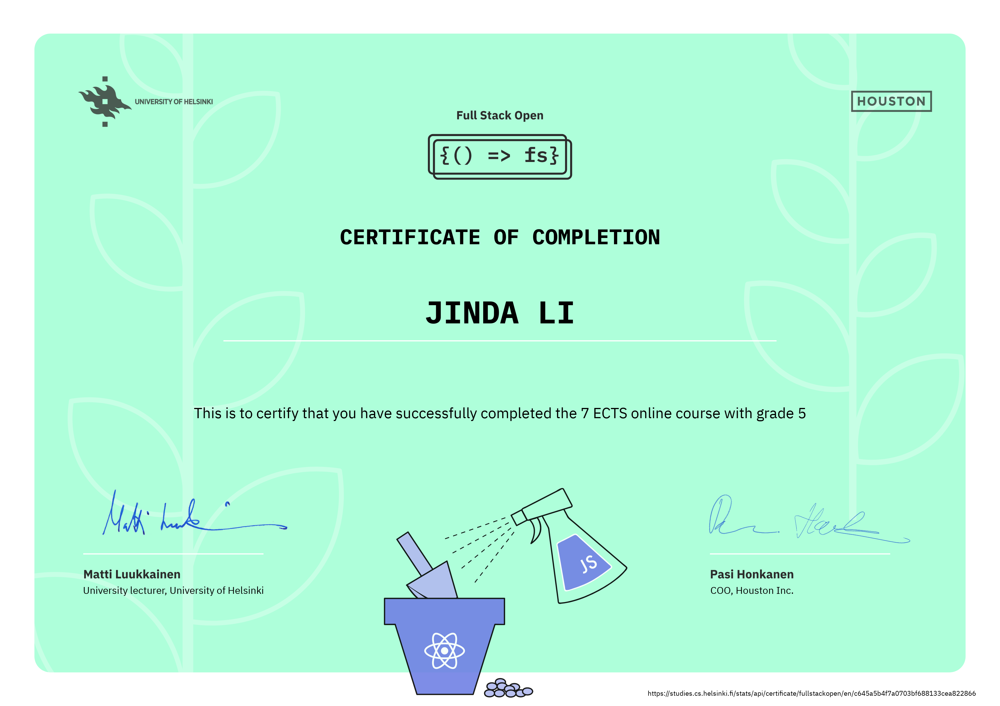
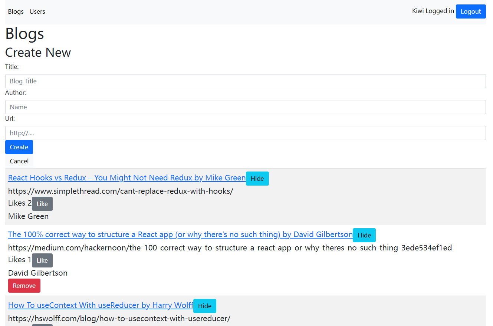
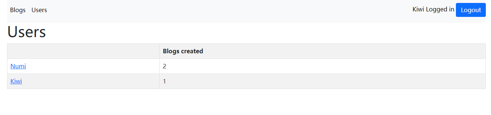
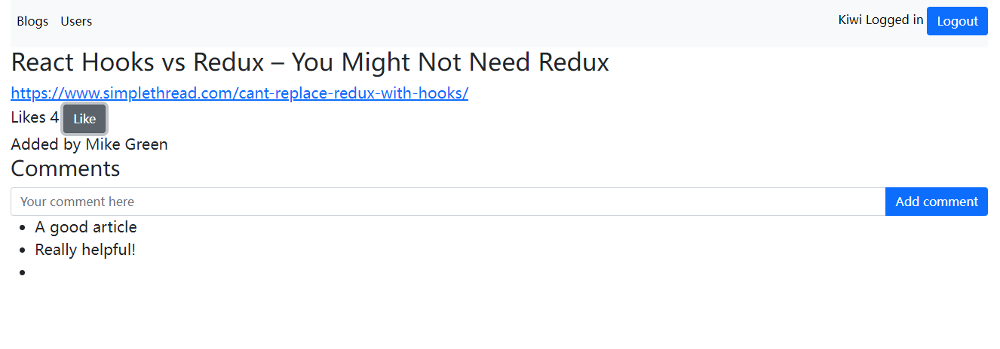
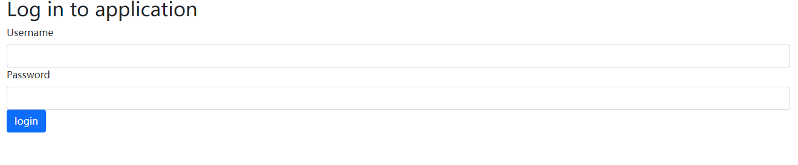

# Full-Stack-Open-Assignments

This is an assignment repository for  [Full Stack Course](https://fullstackopen.com/en/) provided by **University of Helsinki.**

> Learn **React, Redux, Node.js, MongoDB, GraphQL and TypeScript** in one go! This course will introduce you to modern JavaScript-based web development. The main focus is on building single page applications with ReactJS that use REST APIs built with Node.js.

The main parts of the course were completed and a certificate is given.

### Demo Project

A simple blog list website is created:

- Frontend programming with React: customized styles and user-friendly notifications and comments.

- Backend server programming with Express and data management with MongoDB.

- User administration and token administration

- Testing with Jest and Cypress

- State management with Redux

#### Main Page

#### User page

#### Blog Detail Page

#### Login Interface

